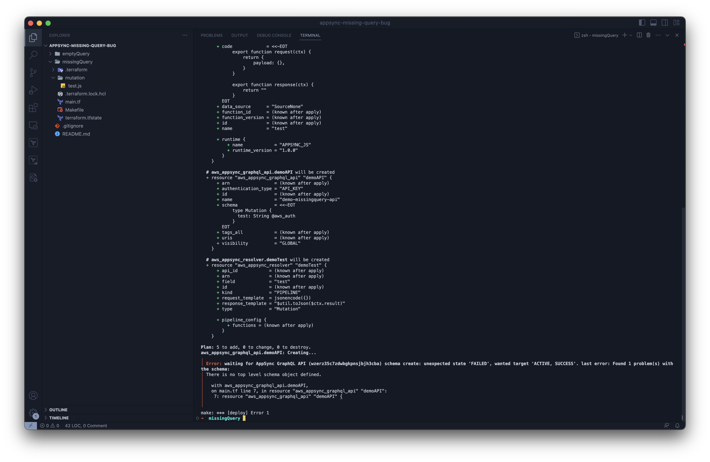
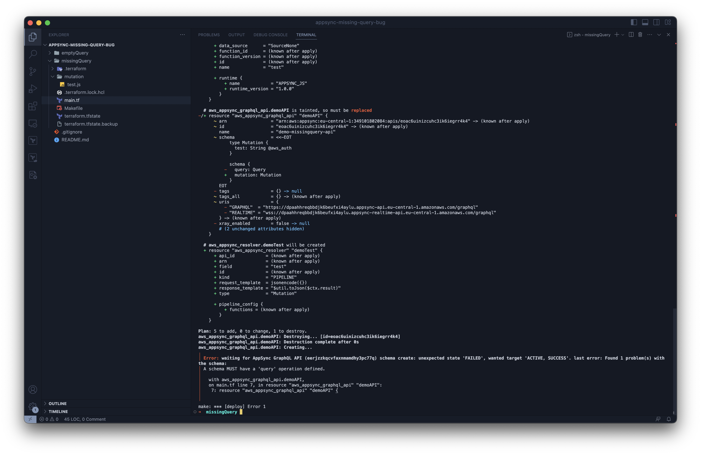
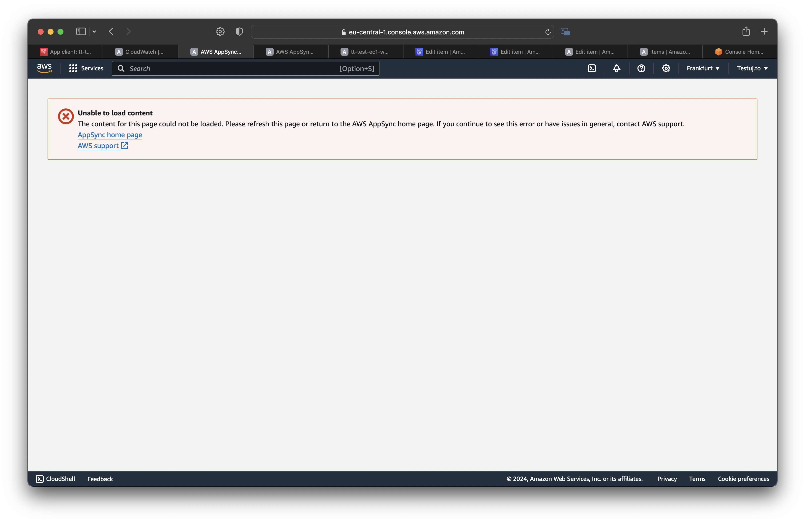

# Reproduction of AS-Script `missing Query` bugs

_Original issue can be found here: [https://github.com/aws/aws-appsync-community/issues/345](https://github.com/aws/aws-appsync-community/issues/345)_


## Missing Query

1. Clone the repo
  ```bash
  git clone https://github.com/testuj-to/appsync-missing-query.git
  cd appsync-missing-query
  ```
2. `cd` to `missingQuery`
  ```bash
  cd missingQuery
  ```
3. Run `make deploy`
4. See the error output
5. Open the file `missingQuery/main.tf` and remove the explicit `schema` from API schema - remove the following lines of code (lines `16-18`):
  ```graphql
  schema {
    mutation: Mutation
  }
  ```
6. Run `make deploy` again
7. See a different error output

| No explicit schema | Explicit schema |
| ------------- | ------------- |
|  |  |

## Empty Query

1. Clone the repo
  ```bash
  git clone https://github.com/testuj-to/appsync-missing-query.git
  cd appsync-missing-query
  ```
2. `cd` to `emptyQuery`
  ```bash
  cd emptyQuery
  ```
3. Run `make deploy`
4. Navigate to the AppSync console, select the `demo-emptyquery-api` API and open the `Queries` tab; see the error page


